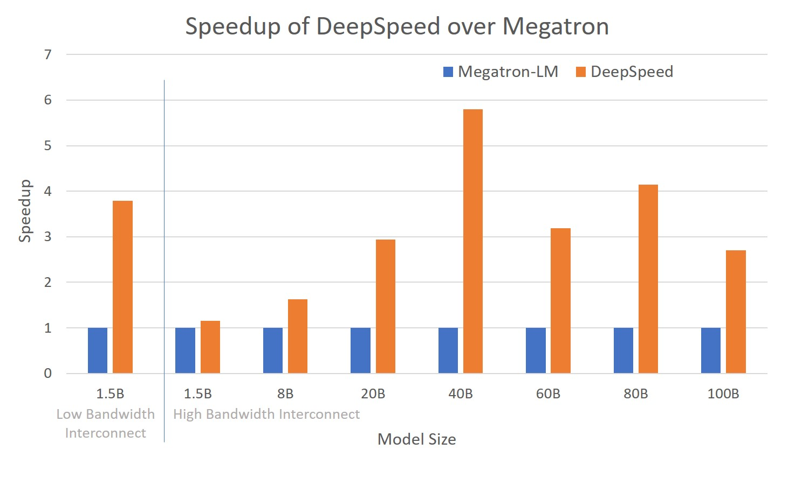

[](https://github.com/microsoft/DeepSpeed/actions)
[](https://pypi.org/project/deepspeed/)
[](https://deepspeed.readthedocs.io/en/latest/?badge=latest)
[](https://github.com/Microsoft/DeepSpeed/blob/master/LICENSE)
[](https://pepy.tech/project/deepspeed)

### DeepSpeed is hiring! Come join us: [SDE 2](https://careers.microsoft.com/us/en/job/1013160/Software-Engineer-2), [Sr. SDE](https://careers.microsoft.com/us/en/job/1017151/Senior-Software-Engineer), [Sr. Researcher](https://careers.microsoft.com/us/en/job/1016440/Senior-Researcher)

[DeepSpeed](https://www.deepspeed.ai/) is a deep learning optimization
library that makes distributed training easy, efficient, and effective.

<p align="center"><i><b>10x Larger Models</b></i></p>
<p align="center"><i><b>5x Faster Training</b></i></p>
<p align="center"><i><b>Minimal Code Change</b></i></p>

DeepSpeed delivers extreme-scale model training for everyone, from data scientists training on massive supercomputers to those training on low-end clusters or even on a single GPU:
* Extreme scale: Using current generation of GPU clusters with hundreds of devices,  3D parallelism of DeepSpeed can efficiently train deep learning models with trillions of parameters.  
* Extremely memory efficient: With just a single GPU, ZeRO-Offload of DeepSpeed can train models with over 10B parameters, 10x bigger than the state of arts, democratizing multi-billion-parameter model training such that many deep learning scientists can explore bigger and better models.
* Extremely long sequence length: Sparse attention of DeepSpeed powers an order-of-magnitude longer input sequence and obtains up to 6x faster execution comparing with dense transformers.  
* Extremely communication efficient: 3D parallelism improves communication efficiency allows users to train multi-billion-parameter models 2–7x faster on clusters with limited network bandwidth.  1-bit Adam/1-bit LAMB reduce communication volume by up to 5x while achieving similar convergence efficiency to Adam/LAMB, allowing for scaling to different types of GPU clusters and networks.

Early adopters of DeepSpeed have already produced
a language model (LM) with over 17B parameters called
[Turing-NLG](https://www.microsoft.com/en-us/research/blog/turing-nlg-a-17-billion-parameter-language-model-by-microsoft),
establishing a new SOTA in the LM category.

DeepSpeed is an important part of Microsoft’s new
[AI at Scale](https://www.microsoft.com/en-us/research/project/ai-at-scale/)
initiative to enable next-generation AI capabilities at scale, where you can find more
information [here](https://innovation.microsoft.com/en-us/exploring-ai-at-scale).

**_For further documentation, tutorials, and technical deep-dives please see [deepspeed.ai](https://www.deepspeed.ai/)!_**


# News
* [2021/08/18] [DeepSpeed powers 8x larger MoE model training with high performance](https://www.microsoft.com/en-us/research/blog/deepspeed-powers-8x-larger-moe-model-training-with-high-performance/)
  * [Mixture of Experts (MoE) tutorial](https://www.deepspeed.ai/tutorials/mixture-of-experts/).
* [2021/08/16] [Curriculum learning: a regularization method for stable and 2.6x faster GPT-2 pre-training with 8x/4x larger batch size/learning rate](https://www.deepspeed.ai/tutorials/curriculum-learning/)
* [2021/05/24] [DeepSpeed: Accelerating large-scale model inference and training via system optimizations and compression](https://www.microsoft.com/en-us/research/blog/deepspeed-accelerating-large-scale-model-inference-and-training-via-system-optimizations-and-compression/)
* [2021/04/20] [1-bit LAMB: up to 4.6x less communication and 2.8x faster training, together with LAMB's convergence speed at large batch sizes](https://www.deepspeed.ai/tutorials/onebit-lamb/)
* [2021/04/19] [ZeRO-Infinity unlocks unprecedented model scale for deep learning training](https://www.microsoft.com/en-us/research/blog/zero-infinity-and-deepspeed-unlocking-unprecedented-model-scale-for-deep-learning-training/)
  * [Tutorial on how to use different stages of ZeRO](https://www.deepspeed.ai/tutorials/zero/)
* [2021/04/01] [[DeepSpeed on AzureML] Transformers and CIFAR examples are now available on AzureML GitHub](https://github.com/Azure/azureml-examples/tree/main/python-sdk/workflows/train/deepspeed)
* [2021/03/30] [[PyTorch Lightning Blog] Accessible Multi-Billion Parameter Model Training with PyTorch Lightning + DeepSpeed](https://medium.com/pytorch-lightning/accessible-multi-billion-parameter-model-training-with-pytorch-lightning-deepspeed-c9333ac3bb59)
* [2021/03/16] [1-bit Adam v2: NCCL-based implementation and more](https://www.deepspeed.ai/tutorials/onebit-adam/)
* [2021/03/08] [ZeRO-3 Offload: Scale your models to trillion parameters without code changes while leveraging both CPUs & GPUs](https://www.deepspeed.ai/news/2021/03/07/zero3-offload.html)
* [2021/01/19] [[🤗Hugging Face Blog] Fit More and Train Faster With ZeRO via DeepSpeed and FairScale](https://huggingface.co/blog/zero-deepspeed-fairscale)


# Table of Contents

| Section                                 | Description                                 |
| --------------------------------------- | ------------------------------------------- |
| [Why DeepSpeed?](#why-deepspeed)        |  DeepSpeed overview                         |
| [Install](#installation)                |  Installation details                       |
| [Features](#features)                   |  Feature list and overview                  |
| [Further Reading](#further-reading)     |  Documentation, tutorials, etc.             |
| [Contributing](#contributing)           |  Instructions for contributing              |
| [Publications](#publications)           |  Publications related to DeepSpeed          |
| [Videos](#videos)                       |  Videos related to DeepSpeed                |

# Why DeepSpeed?
Training advanced deep learning models is challenging. Beyond model design,
model scientists also need to set up the state-of-the-art training techniques
such as distributed training, mixed precision, gradient accumulation, and
checkpointing. Yet still, scientists may not achieve the desired system
performance and convergence rate. Large model sizes are even more challenging:
a large model easily runs out of memory with pure data parallelism and it is
difficult to use model parallelism. DeepSpeed addresses these challenges to
accelerate model development *and* training.

## Distributed, Effective, and Efficient Training with Ease
The DeepSpeed API is a lightweight wrapper on [PyTorch](https://pytorch.org/). This
means that you can use everything you love in PyTorch and without learning a new
platform. In addition, DeepSpeed manages all of the boilerplate state-of-the-art
training techniques, such as distributed training, mixed precision, gradient
accumulation, and checkpoints so that you can focus on your model development. Most
importantly, you can leverage the distinctive efficiency and effectiveness benefit of
DeepSpeed to boost speed and scale with just a few lines of code changes to your PyTorch
models.

## Speed
DeepSpeed achieves high performance and fast convergence through a combination of
efficiency optimizations on compute/communication/memory/IO and effectiveness
optimizations on advanced hyperparameter tuning and optimizers. For example:

**Note:** [PyTorch](https://pytorch.org/) must be installed _before_ installing
DeepSpeed.

```bash
pip install deepspeed
```

After installation, you can validate your install and see which extensions/ops
your machine is compatible with via the DeepSpeed environment report.

  | Devices       | Source    | Training Time (hours) |
  | ------------- | --------- | ---------------------:|
  | 64 TPUs       | Google    |                    96 |
  | 64 V100 GPUs  | DeepSpeed |                **14** |
  | 256 V100 GPUs | NVIDIA    |                   3.9 |
  | 256 V100 GPUs | DeepSpeed |               **3.7** |

  <!---*Read more*: [BERT tutorial](../../Tutorials/bert_pretraining/deepspeed_bert_training.md)-->

  *BERT Tutorial*: Coming Soon

* DeepSpeed trains GPT2 (1.5 billion parameters) 3.75x faster than state-of-art, NVIDIA
  Megatron on Azure GPUs.

  *Read more*: [GPT tutorial](https://www.deepspeed.ai/tutorials/megatron/)


## Memory efficiency
DeepSpeed provides memory-efficient data parallelism and enables training models without
model parallelism. For example, DeepSpeed can train models with up to 6 billion parameters on
NVIDIA V100 GPUs with 32GB of device memory. In comparison, existing frameworks (e.g.,
PyTorch's Distributed Data Parallel) run out of memory with 1.5 billion parameter models.

DeepSpeed reduces the training memory footprint through a novel solution called Zero
Redundancy Optimizer (ZeRO). Unlike basic data parallelism where memory states are
replicated across data-parallel processes, ZeRO partitions model states to save
significant memory. The current implementation (stage 1 of ZeRO) reduces memory by up to
4x relative to the state-of-art. You can read more about ZeRO in our [paper](https://arxiv.org/abs/1910.02054).

With this impressive memory reduction, early adopters of DeepSpeed have already
produced  a language model (LM) with over 17B parameters called
[Turing-NLG](https://www.microsoft.com/en-us/research/blog/turing-nlg-a-17-billion-parameter-language-model-by-microsoft),
establishing a new SOTA in the LM category.


## Scalability
DeepSpeed supports efficient data parallelism, model parallelism, and their
combination. ZeRO boosts the scaling capability and efficiency further.
* DeepSpeed provides system support to run models up to 100 billion parameters,
  10x larger than the state-of-art (8 billion NVIDIA GPT, 11 billion Google T5).
* DeepSpeed can run large models more efficiently, up to 6x faster for models with
  various sizes spanning 1.5B to 100B.  More specifically, the data parallelism powered by ZeRO
  is complementary and can be combined with different types of model parallelism.  It allows
  DeepSpeed to fit models using lower degree of model parallelism and higher batch size, offering
  significant performance gains compared to using model parallelism alone.

  *Read more*: [technical report](https://arxiv.org/abs/1910.02054),
  and [GPT tutorial](https://www.deepspeed.ai/tutorials/megatron/).
  <!-- and [QANet tutorial](../../Tutorials/QANetTutorial.md). -->


<p align="center">
<em>The figure depicts system throughput improvements of DeepSpeed (combining ZeRO-powered data parallelism with model parallelism of NVIDIA Megatron-LM) over using Megatron-LM alone.</em>
</p>


## Fast convergence for effectiveness
DeepSpeed supports advanced hyperparameter tuning and large batch size
optimizers such as [LAMB](https://arxiv.org/abs/1904.00962). These improve the
effectiveness of model training and reduce the number of samples required to
convergence to desired accuracy.

*Read more*: [Tuning tutorial](https://www.deepspeed.ai/tutorials/1Cycle/),
<!---
 and *BERT Tutorial*: Coming Soon.

[BERT tutorial](../../Tutorials/BingBertSquad/BingBertSquadTutorial.md),
[QANet tutorial](../../Tutorials/QANet/QANetTutorial.md)
-->


## Good Usability
Only a few lines of code changes are needed to enable a PyTorch model to use DeepSpeed and ZeRO. Compared to current model parallelism libraries, DeepSpeed does not require a code redesign or model refactoring. It also does not put limitations on model dimensions (such as number of attention heads, hidden sizes, and others), batch size, or any other training parameters. For models of up to six billion parameters, you can use ZeRO-powered data parallelism conveniently without requiring model parallelism, while in contrast, standard data parallelism will run out of memory for models with more than 1.3 billion parameters. In addition, DeepSpeed conveniently supports flexible combination of ZeRO-powered data parallelism with custom model parallelisms, such as tensor slicing of NVIDIA's Megatron-LM.


## Features

On Windows you can build wheel with following steps, currently only inference mode is supported.
1. Install pytorch, such as pytorch 1.8 + cuda 11.1
2. Install visual cpp build tools, such as VS2019 C++ x64/x86 build tools
3. Launch cmd console with Administrator privilege for creating required symlink folders
4. Run `python setup.py bdist_wheel` to build wheel in `dist` folder

# Features
Below we provide a brief feature list, see our detailed [feature
overview](https://www.deepspeed.ai/features/) for descriptions and usage.

* [Distributed Training with Mixed Precision](https://www.deepspeed.ai/features/#distributed-training-with-mixed-precision)
    * 16-bit mixed precision
    * Single-GPU/Multi-GPU/Multi-Node
* [Model Parallelism](https://www.deepspeed.ai/features/#model-parallelism)
  * Support for Custom Model Parallelism
  * Integration with Megatron-LM
* [Pipeline Parallelism](https://www.deepspeed.ai/tutorials/pipeline/)
  * 3D Parallelism
* [The Zero Redundancy Optimizer (ZeRO)](https://www.deepspeed.ai/tutorials/zero/)
  * Optimizer State and Gradient Partitioning
  * Activation Partitioning
  * Constant Buffer Optimization
  * Contiguous Memory Optimization
* [ZeRO-Offload](https://www.deepspeed.ai/tutorials/zero-offload/)
  * Leverage both CPU/GPU memory for model training
  * Support 10B model training on a single GPU
* [Ultra-fast dense transformer kernels](https://www.deepspeed.ai/news/2020/05/18/bert-record.html)
* [Sparse attention](https://www.deepspeed.ai/news/2020/09/08/sparse-attention.html)
  * Memory- and compute-efficient sparse kernels
  * Support 10x longer sequences than dense
  * Flexible support to different sparse structures
* [1-bit Adam](https://www.deepspeed.ai/news/2020/09/08/onebit-adam-blog-post.html) and [1-bit LAMB](https://www.deepspeed.ai/tutorials/onebit-lamb/)
  * Custom communication collective
  * Up to 5x communication volume saving
* [Additional Memory and Bandwidth Optimizations](https://www.deepspeed.ai/features/#additional-memory-and-bandwidth-optimizations)
  * Smart Gradient Accumulation
  * Communication/Computation Overlap
* [Training Features](https://www.deepspeed.ai/features/#training-features)
    * Simplified training API
    * Gradient Clipping
    * Automatic loss scaling with mixed precision
* [Training Optimizers](https://www.deepspeed.ai/features/#training-optimizers)
    * Fused Adam optimizer and arbitrary `torch.optim.Optimizer`
    * Memory bandwidth optimized FP16 Optimizer
    * Large Batch Training with LAMB Optimizer
    * Memory efficient Training with ZeRO Optimizer
* [Training Agnostic Checkpointing](https://www.deepspeed.ai/features/#training-agnostic-checkpointing)
* [Advanced Parameter Search](https://www.deepspeed.ai/features/#advanced-parameter-search)
    * Learning Rate Range Test
    * 1Cycle Learning Rate Schedule
* [Simplified Data Loader](https://www.deepspeed.ai/features/#simplified-data-loader)
* [Curriculum Learning](https://www.deepspeed.ai/tutorials/curriculum-learning/)
  * A curriculum learning-based data pipeline that presents easier or simpler examples earlier during training
  * Stable and 2.6x faster GPT-2 pre-training with 8x/4x larger batch size/learning rate while maintaining token-wise convergence speed
  * Complementary to many other DeepSpeed features
* [Performance Analysis and Debugging](https://www.deepspeed.ai/features/#performance-analysis-and-debugging)
* [Mixture of Experts (MoE)](https://www.deepspeed.ai/tutorials/mixture-of-experts/)

# Getting Started


## Installation

* Please see our [Azure tutorial](https://www.deepspeed.ai/tutorials/azure/) to get started with DeepSpeed on Azure!
* If you're not on Azure, we recommend using our docker image via `docker pull deepspeed/deepspeed:latest` which contains a pre-installed version of DeepSpeed and all the necessary dependencies.
* If you want to install DeepSpeed manually, we provide an install script `install.sh` to help install on a local machine or across an entire cluster.

## Writing DeepSpeed Models
DeepSpeed model training is accomplished using the DeepSpeed engine. The engine
can wrap any arbitrary model of type `torch.nn.module` and has a minimal set of APIs
for training and checkpointing the model. Please see the tutorials for detailed
examples.

To initialize the DeepSpeed engine:
```python
model_engine, optimizer, _, _ = deepspeed.initialize(args=cmd_args,
                                                     model=model,
                                                     model_parameters=params)
```

`deepspeed.inialize` ensures that all of the necessary setup required for
distributed data parallel or mixed precision training are done
appropriately under the hood.  In addition to wrapping the model, DeepSpeed can
construct and manage the training optimizer, data loader, and the learning rate
scheduler based on the parameters passed to `deepspeed.initialze` and the
DeepSpeed [configuration file](#deepspeed-configuration).


### Training

Once the DeepSpeed engine has been initialized, it can be used to train the
model using three simple APIs for forward propagation (`()`), backward
propagation (`backward`), and weight updates (`step`).

```python
for step, batch in enumerate(data_loader):
    #forward() method
    loss = model_engine(batch)

    #runs backpropagation
    model_engine.backward(loss)

    #weight update
    model_engine.step()
```


Under the hood, DeepSpeed automatically performs the necessary operations
required for distributed data parallel training, in mixed precision, with a
pre-defined learning rate schedule:

* **Gradient Averaging**: in distributed data parallel training, `backward`
  ensures that gradients are averaged across data parallel processes after
  training on an `train_batch_size`.

* **Loss Scaling**: in FP16/mixed precision training, the DeepSpeed
  engine automatically handles scaling the loss to avoid precision loss in the
  gradients.

* **Learning Rate Schedule**: if using DeepSpeed's learning rate
  schedule, then DeepSpeed automatically handles any updates to the learning
  rate when `step` is executed.


### Model Checkpointing
Saving and loading the training state is handled via the `save_checkpoint` and
`load_checkpoint` API in DeepSpeed which takes two arguments to uniquely
identify a checkpoint:
  * `ckpt_dir`: the directory where checkpoints will be saved.
  * `ckpt_id`: an identifier that uniquely identifies a checkpoint in the directory.
    In the following code snippet, we use the loss value as the checkpoint identifier.

```python
#load checkpoint
_, client_sd = model_engine.load_checkpoint(args.load_dir, args.ckpt_id)
step = client_sd['step']

#advance data loader to ckpt step
dataloader_to_step(data_loader, step + 1)

for step, batch in enumerate(data_loader):

    #forward() method
    loss = model_engine(batch)

    #runs backpropagation
    model_engine.backward(loss)

    #weight update
    model_engine.step()

    #save checkpoint
    if step % args.save_interval:
        client_sd['step'] = step
        ckpt_id = loss.item()
        model_engine.save_checkpoint(args.save_dir, ckpt_id, client_sd = client_sd)
```

DeepSpeed can automatically save and restore the model, optimizer, and the
learning rate scheduler states while hiding away these details from the user.
However, the user may want to save other data in addition to these that are
unique to a given model training. To support these items, `save_checkpoint`
accepts a client state dictionary `client_sd` for saving. These items can be
retrieved from `load_checkpoint` as a return argument. In the example above,
the `step` value is stored as part of the `client_sd`.


## DeepSpeed Configuration
DeepSpeed features can be enabled, disabled, or configured using a config JSON
file that should be specified as `args.deepspeed_config`. Available configs are at
[deepspeed/pt/deepspeed_constants.py](deepspeed/pt/deepspeed_constants.py).
A sample config file is shown below. For a full set of features see [core API
doc](https://deepspeed.readthedocs.io/en/latest/).

```json
{
  "train_batch_size": 8,
  "gradient_accumulation_steps": 1,
  "optimizer": {
    "type": "Adam",
    "params": {
      "lr": 0.00015
    }
  },
  "fp16": {
    "enabled": true
  },
  "zero_optimization": true
}
```

## Multi-Node Environment Variables

When training across multiple nodes we have found it useful to support
propagating user-defined environment variables. By default DeepSpeed will
propagate all NCCL and PYTHON related environment variables that are set. If
you would like to propagate additional variables you can specify them in a
dot-file named `.deepspeed_env` that contains a new-line separated list of
`VAR=VAL` entries. The DeepSpeed launcher will look in the local path you are
executing from and also in your home directory (`~/`).

As a concrete example, some clusters require special NCCL variables to set
prior to training. The user can simply add these variables to a
`.deepspeed_env` file in their home directory that looks like this:
```
NCCL_IB_DISABLE=1
NCCL_SOCKET_IFNAME=eth0
```
DeepSpeed will then make sure that these environment variables are set when
launching each process on every node across their training job.

# Launching DeepSpeed Training
DeepSpeed installs the entry point `deepspeed` to launch distributed training.
We illustrate an example usage of DeepSpeed with the following assumptions:

1. You have already integrated DeepSpeed into your model
2. `client_entry.py` is the entry script for your model
3. `client args` is the `argparse` command line arguments
4. `ds_config.json` is the configuration file for DeepSpeed


## Resource Configuration (multi-node)
DeepSpeed configures multi-node compute resources with hostfiles that are compatible with
[OpenMPI](https://www.open-mpi.org/) and [Horovod](https://github.com/horovod/horovod).
A hostfile is a list of *hostnames* (or SSH aliases), which are machines accessible via passwordless
SSH, and *slot counts*, which specify the number of GPUs available on the system. For
example,
```
worker-1 slots=4
worker-2 slots=4
```
specifies that two machines named *worker-1* and *worker-2* each have four GPUs to use
for training.

Hostfiles are specified with the `--hostfile` command line option. If no hostfile is
specified, DeepSpeed searches for `/job/hostfile`. If no hostfile is specified or found,
DeepSpeed queries the number of GPUs on the local machine to discover the number of local
slots available.


The following command launches a PyTorch training job across all available nodes and GPUs
specified in `myhostfile`:
```bash
deepspeed <client_entry.py> <client args> \
  --deepspeed --deepspeed_config ds_config.json --hostfile=myhostfile
```

Alternatively, DeepSpeed allows you to restrict distributed training of your model to a
subset of the available nodes and GPUs. This feature is enabled through two command line
arguments: `--num_nodes` and `--num_gpus`. For example, distributed training can be
restricted to use only two nodes with the following command:
```bash
deepspeed --num_nodes=2 \
	<client_entry.py> <client args> \
	--deepspeed --deepspeed_config ds_config.json
```
You can instead include or exclude specific resources using the `--include` and
`--exclude` flags. For example, to use all available resources **except** GPU 0 on node
*worker-2* and GPUs 0 and 1 on *worker-3*:
```bash
deepspeed --exclude="worker-2:0@worker-3:0,1" \
	<client_entry.py> <client args> \
	--deepspeed --deepspeed_config ds_config.json
```
Similarly, you can use **only** GPUs 0 and 1 on *worker-2*:
```bash
deepspeed --include="worker-2:0,1" \
	<client_entry.py> <client args> \
	--deepspeed --deepspeed_config ds_config.json
```

### MPI Compatibility
As described above, DeepSpeed provides its own parallel launcher to help launch
multi-node/multi-gpu training jobs. If you prefer to launch your training job
using MPI (e.g., mpirun), we provide support for this. It should be noted that
DeepSpeed will still use the torch distributed NCCL backend and *not* the MPI
backend. To launch your training job with mpirun + DeepSpeed you simply pass us
an additional flag `--deepspeed_mpi`. DeepSpeed will then use
[mpi4py](https://pypi.org/project/mpi4py/) to discover the MPI environment (e.g.,
rank, world size) and properly initialize torch distributed for training. In this
case you will explicitly invoke `python` to launch your model script instead of using
the `deepspeed` launcher, here is an example:
```bash
mpirun <mpi-args> python \
	<client_entry.py> <client args> \
	--deepspeed_mpi --deepspeed --deepspeed_config ds_config.json
```

If you want to use this feature of DeepSpeed, please ensure that mpi4py is
installed via `pip install mpi4py`.

## Resource Configuration (single-node)
In the case that we are only running on a single node (with one or more GPUs)
DeepSpeed *does not* require a hostfile as described above. If a hostfile is
not detected or passed in then DeepSpeed will query the number of GPUs on the
local machine to discover the number of slots available. The `--include` and
`--exclude` arguments work as normal, but the user should specify 'localhost'
as the hostname.


# Further Reading

| Article                                                                                        | Description                                  |
| ---------------------------------------------------------------------------------------------- | -------------------------------------------- |
| [DeepSpeed Features](https://www.deepspeed.ai/features/)                                       |  DeepSpeed features                          |
| [Getting Started](https://www.deepspeed.ai/getting-started/)                                   |  First steps with DeepSpeed                  |
| [DeepSpeed JSON Configuration](https://www.deepspeed.ai/docs/config-json/)                     |  Configuring DeepSpeed                       |
| [API Documentation](https://deepspeed.readthedocs.io/en/latest/)                               |  Generated DeepSpeed API documentation       |
| [CIFAR-10 Tutorial](https://www.deepspeed.ai/tutorials/cifar-10)                               |  Getting started with CIFAR-10 and DeepSpeed |
| [Megatron-LM Tutorial](https://www.deepspeed.ai/tutorials/megatron/)                           |  Train GPT2 with DeepSpeed and Megatron-LM   |
| [BERT Pre-training Tutorial](https://www.deepspeed.ai/tutorials/bert-pretraining/)             |  Pre-train BERT with DeepSpeed               |
| [Learning Rate Range Test Tutorial](https://www.deepspeed.ai/tutorials/lrrt/)                  |  Faster training with large learning rates   |
| [1Cycle Tutorial](https://www.deepspeed.ai/tutorials/one-cycle/)                               |  SOTA learning schedule in DeepSpeed         |


# Contributing
DeepSpeed welcomes your contributions! Please see our
[contributing](CONTRIBUTING.md) guide for more details on formatting, testing,
etc.

## Contributor License Agreement
This project welcomes contributions and suggestions. Most contributions require you to
agree to a Contributor License Agreement (CLA) declaring that you have the right to, and
actually do, grant us the rights to use your contribution. For details, visit
https://cla.opensource.microsoft.com.

When you submit a pull request, a CLA bot will automatically determine whether you need
to provide a CLA and decorate the PR appropriately (e.g., status check, comment). Simply
follow the instructions provided by the bot. You will only need to do this once across
all repos using our CLA.

## Code of Conduct
This project has adopted the [Microsoft Open Source Code of
Conduct](https://opensource.microsoft.com/codeofconduct/). For more information see the
[Code of Conduct FAQ](https://opensource.microsoft.com/codeofconduct/faq/) or contact
[opencode@microsoft.com](mailto:opencode@microsoft.com) with any additional questions or
comments.

# Publications
1. Samyam Rajbhandari, Jeff Rasley, Olatunji Ruwase, Yuxiong He. (2019) ZeRO: memory optimizations toward training trillion parameter models. [arXiv:1910.02054](https://arxiv.org/abs/1910.02054) and [In Proceedings of the International Conference for High Performance Computing, Networking, Storage and Analysis (SC '20)](https://dl.acm.org/doi/10.5555/3433701.3433727).
2. Jeff Rasley, Samyam Rajbhandari, Olatunji Ruwase, and Yuxiong He. (2020) DeepSpeed: System Optimizations Enable Training Deep Learning Models with Over 100 Billion Parameters. [In Proceedings of the 26th ACM SIGKDD International Conference on Knowledge Discovery & Data Mining (KDD '20, Tutorial)](https://dl.acm.org/doi/10.1145/3394486.3406703).
3. Minjia Zhang, Yuxiong He. (2020) Accelerating Training of Transformer-Based Language Models with Progressive Layer Dropping. [arXiv:2010.13369](https://arxiv.org/abs/2010.13369) and [NeurIPS 2020](https://proceedings.neurips.cc/paper/2020/hash/a1140a3d0df1c81e24ae954d935e8926-Abstract.html).
4. Jie Ren, Samyam Rajbhandari, Reza Yazdani Aminabadi, Olatunji Ruwase, Shuangyan Yang, Minjia Zhang, Dong Li, Yuxiong He. (2021) ZeRO-Offload: Democratizing Billion-Scale Model Training. [arXiv:2101.06840](https://arxiv.org/abs/2101.06840).
5. Hanlin Tang, Shaoduo Gan, Ammar Ahmad Awan, Samyam Rajbhandari, Conglong Li, Xiangru Lian, Ji Liu, Ce Zhang, Yuxiong He. (2021) 1-bit Adam: Communication Efficient Large-Scale Training with Adam's Convergence Speed. [arXiv:2102.02888](https://arxiv.org/abs/2102.02888) and [ICML 2021](http://proceedings.mlr.press/v139/tang21a.html).
6. Samyam Rajbhandari, Olatunji Ruwase, Jeff Rasley, Shaden Smith, Yuxiong He. (2021) ZeRO-Infinity: Breaking the GPU Memory Wall for Extreme Scale Deep Learning. [arXiv:2104.07857](https://arxiv.org/abs/2104.07857).
7. Conglong Li, Ammar Ahmad Awan, Hanlin Tang, Samyam Rajbhandari, Yuxiong He. (2021) 1-bit LAMB: Communication Efficient Large-Scale Large-Batch Training with LAMB's Convergence Speed. [arXiv:2104.06069](https://arxiv.org/abs/2104.06069).
8. Conglong Li, Minjia Zhang, Yuxiong He. (2021) Curriculum Learning: A Regularization Method for Efficient and Stable Billion-Scale GPT Model Pre-Training. [arXiv:2108.06084](https://arxiv.org/abs/2108.06084).

# Videos
1. DeepSpeed KDD 2020 Tutorial
    1. [Overview](https://www.youtube.com/watch?v=CaseqC45DNc&list=PLa85ZdUjfWS21mgibJ2vCvLziprjpKoW0&index=29)
    2. [ZeRO + large model training](https://www.youtube.com/watch?v=y4_bCiAsIAk&list=PLa85ZdUjfWS21mgibJ2vCvLziprjpKoW0&index=28)
    3. [17B T-NLG demo](https://www.youtube.com/watch?v=9V-ZbP92drg&list=PLa85ZdUjfWS21mgibJ2vCvLziprjpKoW0&index=27)
    4. [Fastest BERT training + RScan tuning](https://www.youtube.com/watch?v=o1K-ZG9F6u0&list=PLa85ZdUjfWS21mgibJ2vCvLziprjpKoW0&index=26)
    5. DeepSpeed hands on deep dive: [part 1](https://www.youtube.com/watch?v=_NOk-mBwDYg&list=PLa85ZdUjfWS21mgibJ2vCvLziprjpKoW0&index=92), [part 2](https://www.youtube.com/watch?v=sG6_c4VXLww&list=PLa85ZdUjfWS21mgibJ2vCvLziprjpKoW0&index=94), [part 3](https://www.youtube.com/watch?v=k9yPkBTayos&list=PLa85ZdUjfWS21mgibJ2vCvLziprjpKoW0&index=93)
    6. [FAQ](https://www.youtube.com/watch?v=nsHu6vEgPew&list=PLa85ZdUjfWS21mgibJ2vCvLziprjpKoW0&index=24)
2. Microsoft Research Webinar
    * Registration is free and all videos are available on-demand.
    * [ZeRO & Fastest BERT: Increasing the scale and speed of deep learning training in DeepSpeed](https://note.microsoft.com/MSR-Webinar-DeepSpeed-Registration-On-Demand.html).
3. [DeepSpeed on AzureML](https://youtu.be/yBVXR8G8Bg8)
4. Community Tutorials
    * [DeepSpeed: All the tricks to scale to gigantic models](https://www.youtube.com/watch?v=pDGI668pNg0)
    * [Turing-NLG, DeepSpeed and the ZeRO optimizer](https://www.youtube.com/watch?v=tC01FRB0M7w)
